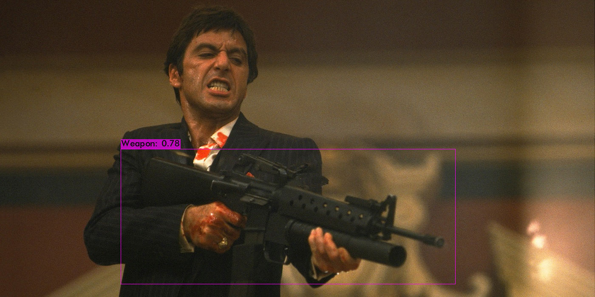
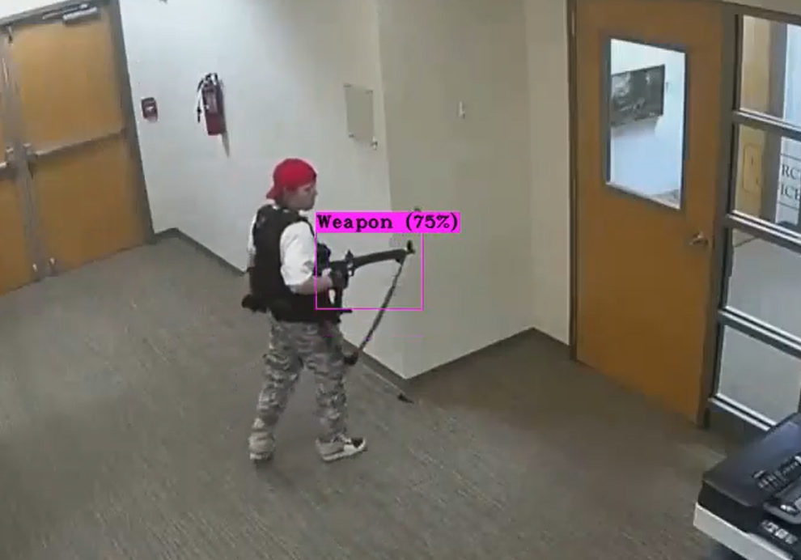
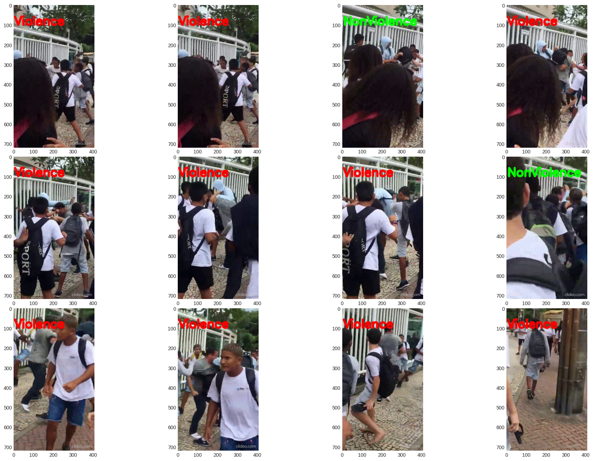

# Motivation
With the increase in violence in school areas becoming a worrying problem in recent years, several initiatives and solutions have been adopted to strengthen security and ensure the well-being of the population. Among the solutions that have been adopted are the reinforcement of security at school entrances, evacuation measures, and the panic button for education professionals working at the sites. However, these solutions have physical limitations, since they depend on human action to be effective and, in many cases, they are not at the site of the incident at the time it occurs. Given this scenario, it is essential to seek alternatives that allow speeding up and automating the control of violence in schools, and in this sense, the use of surveillance cameras with computer vision models presents itself as a promising solution to this challenge, allowing the automatic detection of weapons and suspicious behavior in real time, which can help prevent and reduce violence.

# Data Source
The data used for training the YOLOv7 custom model was obtained from the Open Images dataset, which is a publicly available collection of diverse labeled images. The dataset provides a wide range of annotated images that include instances of weapons, enabling the development and training of accurate detection models. The dataset can be accessed and downloaded from the following link: [Open Images Dataset](https://storage.googleapis.com/openimages/web/index.html).

The data used for training the MoBi-LSTM was obtained from Kaggle's competition: Real Time Violence Detection Dataset that provides a 2 thousands cases of violence and non-violence videos. The dataset can be acessed and downloaded from the following link: [Real Time Violence Detection Dataset](https://www.kaggle.com/datasets/mohamedmustafa/real-life-violence-situations-dataset)

# Darknet with YOLOv7 for Weapons Detection
To address the detection of weapons, we utilize Darknet, an open-source neural network framework, along with YOLOv7 (You Only Look Once) object detection algorithm. YOLOv7 is renowned for its real-time and accurate object detection capabilities. By customizing the YOLOv7 model with a focus on detecting weapons, we can identify and localize instances of weapons in the security camera footage with high precision.

# MobileNet Bi-LSTM for Violence Detection
The MobileNet Bi-LSTM model is employed for the detection of violence in the security camera footage. MobileNet is a lightweight deep learning model that exhibits excellent performance in terms of accuracy and efficiency on mobile and embedded devices. The Bi-LSTM component enhances the model's ability to capture temporal dependencies and contextual information, improving the accuracy of violence detection in sequential data.

# Contributing
We welcome contributions to enhance and improve the project. If you have any suggestions, bug reports, or feature requests, please submit them as issues on the GitHub repository.

# Acknowledgments
We would like to express our gratitude to the developers and contributors of the MobileNet, Bi-LSTM, Darknet, and YOLOv7 projects for their exceptional work and the Open Images dataset creators for providing a valuable resource for training and evaluation.

For any further inquiries or questions, please contact me at william.qgdi@gmail.com
